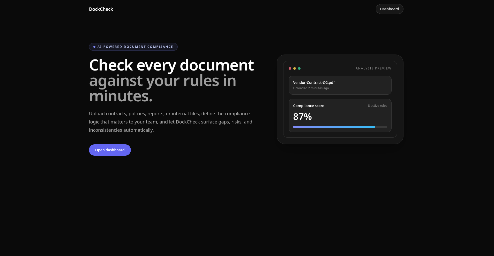
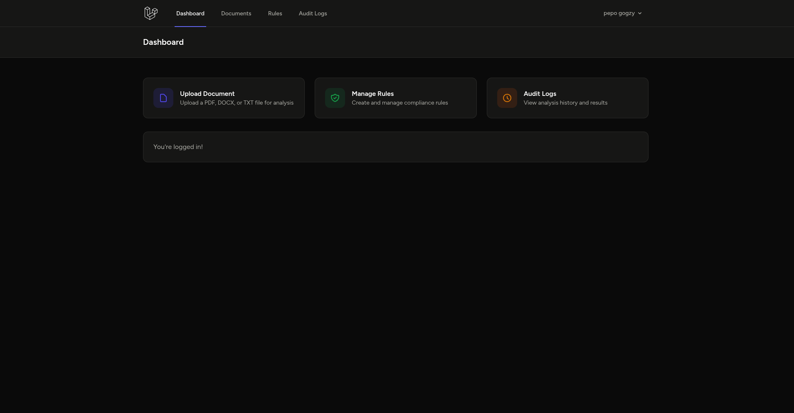
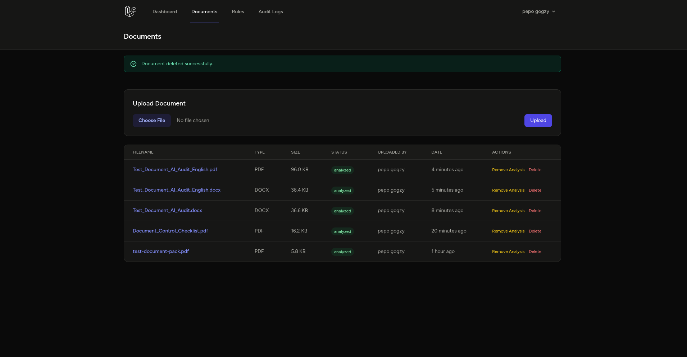
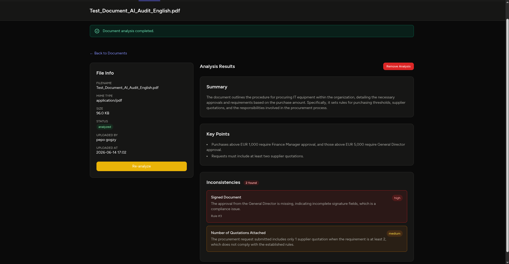
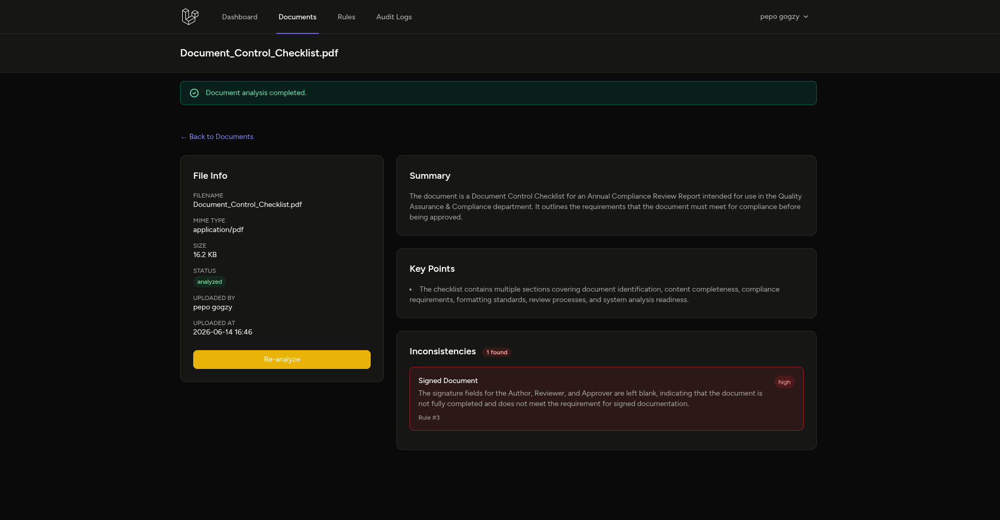
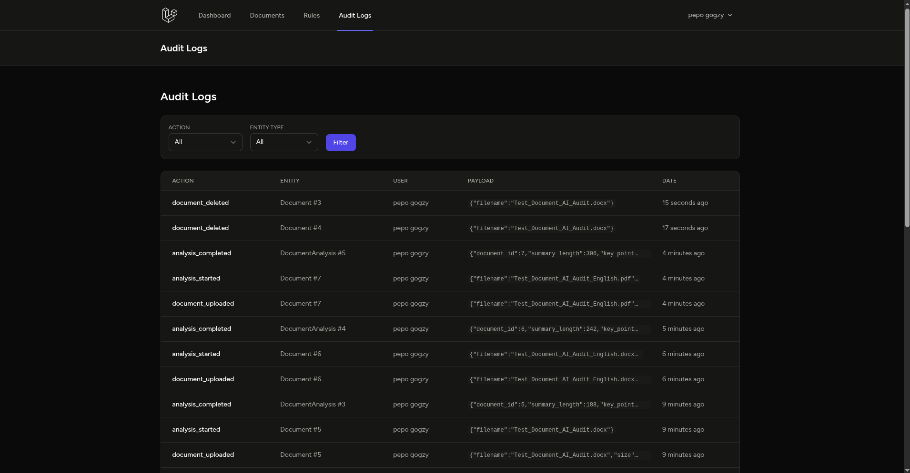

# DockCheck – Document Compliance Analysis

AI-powered document compliance checking. Upload documents, define rules, and get automated analysis with inconsistency detection.



The landing page introduces DockCheck with a clean hero section, feature highlights, and a call-to-action to register or log in. The dark theme carries through all pages with consistent card-based layouts.

---

## Features

### Dashboard
After logging in, the dashboard provides quick access to upload documents, manage rules, and view audit logs.



The dashboard serves as the command centre. Quick-action buttons link directly to the document upload form, rules editor, and audit trail. Recent activity summaries give an at-a-glance overview of your compliance status.

### Document Management
Upload PDF, DOCX, TXT, or image files. Each document is stored securely with metadata tracking (filename, type, size, upload date, status).



The documents page lists all uploaded files in a sortable table with status badges (pending / analyzed). Click any row to view details, run or re-run analysis, and inspect results. Uploads are validated by extension — no more MIME-detection headaches.

### Compliance Rules
Create custom rules describing requirements your documents must satisfy. Rules can be toggled active/inactive and are evaluated by AI during every analysis run.

Rules define the compliance baseline. Each rule has a title, description, and active toggle. Only active rules are sent to the AI during analysis. This lets you build a library of requirements and selectively apply them per-session.

### AI Analysis
One click analyses a document against all active rules using OpenAI. Results include a summary, key points, and a list of inconsistencies with severity ratings (low / medium / high).



The top of the analysis view shows an AI-generated summary of the document and a bullet list of key points. This gives you a quick understanding of the document's content before diving into rule violations.



Below the summary, each inconsistency is listed with its severity badge (red for high, yellow for medium, grey for low), the rule it violated, and a description of the issue. The associated rule ID is linked for quick reference.

### Audit Trail
Every action — document uploads, analysis runs, rule changes — is logged with timestamps and user attribution for full traceability.



The audit log is a chronological, filterable table of every event in the system. Use it to track who did what and when — essential for compliance auditing and debugging.

---

## How It Works

1. **Text Extraction** — When a document is uploaded, the service extracts raw text based on MIME type (PDF via `smalot/pdfparser`, DOCX via ZIP/XML parsing, plain text directly).
2. **Prompt Assembly** — The extracted text is combined with all active rules into a structured prompt that asks OpenAI to summarise the document, extract key points, and cross-reference against each rule.
3. **AI Evaluation** — The prompt is sent to OpenAI's chat completions endpoint. The model returns a JSON object with `summary`, `key_points`, and `inconsistencies` (each with `rule_title`, `description`, `severity`).
4. **Result Persistence** — The parsed response is saved to the `document_analyses` table. Inconsistencies are mapped back to rule IDs by matching rule titles.
5. **Audit Logging** — Every step (upload, analysis start, completion, failure) is recorded in `audit_logs` for traceability.

The analysis service lives in `app/Services/DocumentAnalysisService.php`. The prompt template and JSON response format are defined there with no hardcoded logic — the LLM does all the comparison work.

---

## Quick Start

```bash
composer install
cp .env.example .env
php artisan key:generate
# Add your OPENAI_API_KEY to .env
php artisan migrate
npm install && npm run build
php artisan serve
```

Visit `http://localhost:8000`, register, and log in.

---

## Tech Stack

- **Backend**: PHP 8.2, Laravel 12, SQLite
- **Frontend**: Tailwind CSS, Alpine.js, Vite
- **AI**: OpenAI API (gpt-4o-mini)
- **Auth**: Laravel Breeze (session-based)
